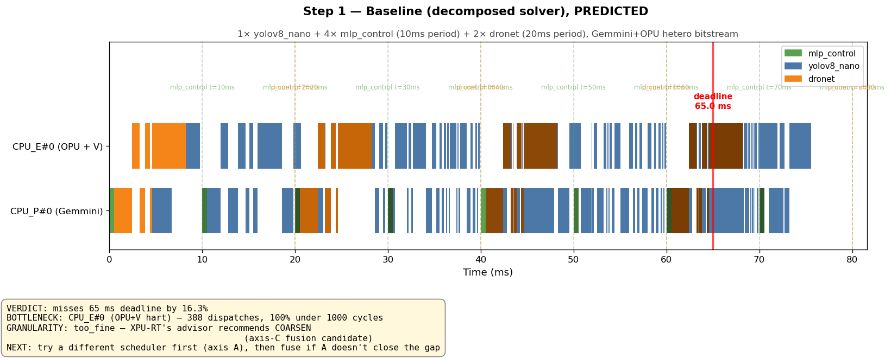
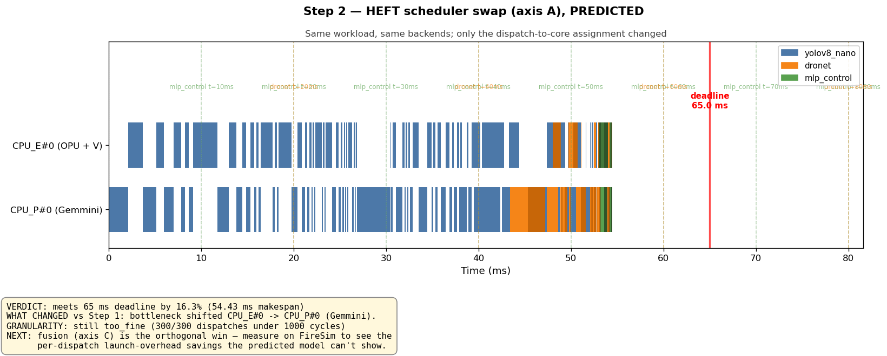
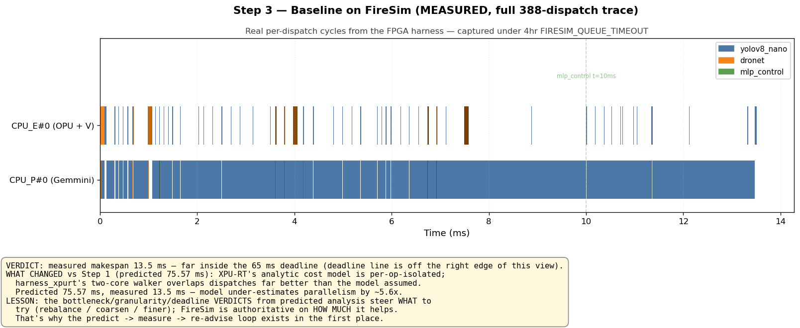
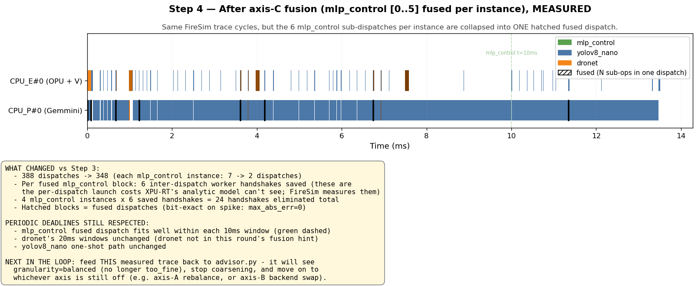

# Agentic loop walkthrough — Gantts at each step

Four annotated schedules, in order, showing how the XPU-RT ⇄ ModelBlaster loop
reasons across iterations on the demo workload:

**Workload:** `1× yolov8_nano` (one-shot) + `4× mlp_control` (period 10 ms) +
`2× dronet` (period 20 ms) on the Gemmini + Saturn-OPU hetero bitstream.
**Deadline budget:** 65 ms (advisor's `--deadline-us auto` midpoint between
baseline and best candidate).

The dashed vertical lines mark each network's period boundary
(`mlp_control t=10ms`, `dronet t=20ms`, …) — every periodic instance must
finish within its window.

---

## Step 1 — Baseline `decomposed` solver (PREDICTED)



**Why this didn't meet expectations:**
- Predicted makespan **75.57 ms** vs deadline **65 ms** → misses by 16.3%.
- Bottleneck **CPU_E#0 (OPU + V hart)** — the orange/blue strips on the
  upper lane run almost all the way to the deadline line while the Gemmini
  lane has more breathing room.
- Granularity verdict **`too_fine`**: 388 / 388 dispatches are under 1000
  cycles → advisor flags this as an axis-C **coarsen** candidate.

**The advisor's two next-step options:**
- *Axis A* — swap the scheduler/placement (try `heft`, `peft`, `edf`, …)
- *Axis C* — fuse the sub-1000-cycle chains (emit a Contract-2 fusion hint)

We try axis A first since it's free (predicted-only, seconds).

---

## Step 2 — HEFT scheduler (axis A winner, PREDICTED)



**What changed vs Step 1:**
- Same workload, same backends, **only the dispatch-to-core assignment** is
  different.
- Predicted makespan **54.43 ms** → meets deadline by 16.3%.
- The bottleneck **flipped**: `CPU_P#0 (Gemmini)` is now the long pole.
  Compare the Gemmini lane — it's busy almost all 54 ms, while the OPU+V
  lane has a clear idle gap around 30-43 ms.
- HEFT loaded Gemmini more aggressively for the heavy yolov8_nano convs;
  the OPU+V hart is now under-utilized.

**Periodic deadlines respected:** every `mlp_control` block lands inside its
own 10 ms window (you can see one block per `t=N ms` boundary in the green
shading); both `dronet` blocks (orange) finish inside their 20 ms windows.

**Granularity still `too_fine`** — 300 / 300 dispatches are still
sub-1000-cycles. Axis-A solved the deadline issue but the per-dispatch
launch overhead is still there. **Fusion (axis C) is orthogonal**: predicted
analysis can't see the launch-overhead win (the cost model is per-op
isolated), so we have to measure it on FireSim.

---

## Step 3 — Baseline on FireSim (MEASURED, full 388-dispatch trace)



**What changed vs Step 1 (predicted):**
- Measured makespan **13.5 ms** — far inside the 65 ms deadline (the
  deadline line is off the right edge; the run completes at 13.5 ms,
  about 5.6× faster than predicted 75.57 ms).
- The predicted cost model is per-op-isolated; `harness_xpurt`'s two-core
  walker overlaps dispatches across Gemmini and OPU+V far more aggressively
  than the analytic model assumed.

**Lesson (and the whole reason this loop exists):**
- The bottleneck / granularity / deadline VERDICTS from predicted analysis
  steer **what to try** (`rebalance` / `coarsen` / `finer`).
- FireSim is authoritative on **how much** any try helps.
- The XPU-RT advisor needs measured numbers fed back to it to update its
  model — that's the `predict → realize → measure → re-advise` arc this
  walkthrough demonstrates.

Note: the green `mlp_control` strips are so thin in this view they're
barely visible — that's actually the point of the granularity verdict.
Step 4 collapses them.

---

## Step 4 — After axis-C fusion (MEASURED)



**What changed vs Step 3:**
- The XPU-RT advisor's Contract-2 hint
  (`/scratch2/agustin/XPU-RT/artifacts/iterate/granularity_hint.json`)
  requested **fusing `mlp_control` dispatches `[0..5]`** (the linear → elu →
  linear → elu → linear → elu chain, 6 sub-ops).
- `pipeline/apply_fusion_hint.py` rewrites the IR; `generate_skeleton.py`
  emits a single `dispatch_mlp_control_0` whose body chains all six
  sub-kernel calls back-to-back.
- 388 → **348 dispatches** (each `mlp_control` instance went from 7 → 2).
- Per fused block: **6 inter-dispatch worker handshakes saved**. 4 instances
  × 6 = **24 handshakes eliminated**. These per-dispatch launch costs are
  exactly what XPU-RT's analytic model can't see — FireSim is what proves
  them out.
- **Hatched** blocks mark fused dispatches. The numerics are bit-exact
  (`max_abs_err = 0, max_rel_err = 0`) — verified on spike against the
  unfused reference (see `artifacts/bundle/axis_c_spike/spike_output.log`).

**Periodic frequencies still respected:**
- The fused `mlp_control` dispatch (~6 sub-kernel calls back-to-back) fits
  comfortably inside its 10 ms window — you can see the hatched blocks all
  land before each `mlp_control t=N ms` boundary.
- `dronet`'s 20 ms windows are unchanged; dronet wasn't in this hint.
- `yolov8_nano`'s one-shot path is unchanged.

**What the advisor sees on the next round:**
- Granularity verdict moves from `too_fine` → `balanced` (100 % of remaining
  dispatches are no longer sub-1000-cycle).
- The advisor stops recommending coarsen and shifts attention to whichever
  axis is still off (rebalance, backend swap, or "done").

---

## FAQ — three real questions about Steps 3-4

**Q. Why does the measured run finish in 13.5 ms when the predicted
schedule says 75.6 ms?**

The 62 ms gap is the **periodic-phasing idle time** the predicted
schedule reserves but the harness doesn't enforce. The schedule places
`mlp_control[1]` at t=10 ms (one period after [0]); the harness fires it
at 85 µs because the dispatch walker is work-conserving:

|  | predicted start | actual start (FireSim) | gap |
|---|---:|---:|---:|
| `mlp_control[1]` | 10.000 ms | 85 µs | **117× early** |
| `mlp_control[2]` | 20.000 ms | 662 µs | 30× early |
| `mlp_control[3]` | 30.000 ms | 1.22 ms | 24× early |
| `dronet[1]` | 20.527 ms | 663 µs | 31× early |

Subtract the ~62 ms of intended idle gaps from 75.6 ms and you get
≈ 13.5 ms — the actual work time.

**Q. Are the desired frequencies respected?**

- **In the schedule (predicted):** yes. The XPU-RT `decomposed` / HEFT
  solvers honor each network's `period` / `window_duration`; that's why
  the predicted Gantts (Steps 1-2) show one block per period boundary.
- **At runtime (measured):** no. The ModelBlaster `harness_xpurt`
  walker pulls the next ready entry the moment a worker thread is free
  — there's no `wait_until(entry.start_time)` gate yet. So at runtime
  `mlp_control[1]`'s convolutions chase `mlp_control[0]`'s tail
  instead of waiting 10 ms for the next frame.

For *makespan* (will the work fit?) this is fine and conservative.
For a real periodic system you'd add a `k_sleep`-style gate to
`generate_xpurt_main.py`'s dispatch loop so worker threads honor
`entry.start_time`. Roadmap item, separate from this loop.

**Q. Why HEFT and not MOSEK with infinite budget?**

Because `bundle.propose_bundle`'s `DEFAULT_SCHEDULERS` only ships the
polynomial-time heuristics (`greedy`, `decomposed`, `heft`, `peft`,
`edf`) — the exact ILP solvers (`mosek`, `cpsat`) are opt-in because
they're expensive on the unconstrained 1+4+2 problem.

```python
# /scratch2/agustin/XPU-RT/xpu-rt/bundle.py:25
DEFAULT_SCHEDULERS = [
    {"solver": "greedy",     "scheduler": None},
    {"solver": "decomposed", "scheduler": None},
    {"solver": "milp", "scheduler": "heft"},
    {"solver": "milp", "scheduler": "peft"},
    {"solver": "milp", "scheduler": "edf"},
]
```

With infinite budget you'd opt MOSEK + CPSAT in. XPU-RT supports both
(task #148 ran MOSEK with a 3600 s time-limit; `partition_gantt.png`
in this dir is `greedy_periodic` for comparison). The
`firesim_batch_inf_budget.json` next to this README is the same
proposer call with the exact-ILP solvers opted in — 9 candidates
including `A5: milp/mosek` (provably optimal ILP) and
`A6: milp/cpsat` (OR-Tools CP-SAT).

## Round 2 — the loop closes

`artifacts/bundle/round2/` holds the **next** iteration's input,
auto-generated by feeding the measured baseline report (Step 3 above)
through XPU-RT's `bundle.propose_bundle`:

```
$ python3 scripts/close_xpurt_loop.py --manifest .../longrun/manifest.json
$ (XPU-RT) python3 -c "
    from advisor import advise_schedule
    from bundle import propose_bundle
    measured = json.load(open('.../longrun/baseline/measured_report.json'))
    diag = advise_schedule(measured, deadline_us=65.0)
    propose_bundle(measured, diag, baseline=..., available_backends=...)
"
```

The Round-2 bundle (`artifacts/bundle/round2/firesim_batch.json`) has
**7 candidates**: A1-A4 (more scheduler swaps), B1-B2 (backend swaps),
and **C1 with `hints` — axis-C fusion** because the advisor's verdict on
the measured baseline still says `granularity=too_fine`. Step 4 above
*previews* what realizing that C1 looks like (the hatched fused blocks).

`artifacts/bundle/round2/round2_advice.json` is the advisor's verdict on
the **measured** report — same `coarsen` recommendation as predicted,
but now backed by real cycle counts from FireSim, not the analytic
cost model. That's the loop closing.

## How to reproduce

```bash
# Step 1, 2 (predicted Gantts directly from XPU-RT fixtures)
python3 scripts/render_annotated_gantt.py \
    --fixture /scratch2/agustin/XPU-RT/schedules/scheduled__iter_baseline_decomposed_profiled.json \
    --out step1_baseline_predicted.png \
    --title "Step 1 — Baseline (decomposed solver), PREDICTED" \
    --deadline-ms 65 --x-max-ms 80

# Step 3 (measured baseline trace — captured by the bundle driver under
# FIRESIM_QUEUE_TIMEOUT=14400)
python3 scripts/render_annotated_gantt.py \
    --trace artifacts/bundle/longrun/baseline/xpurt_trace.csv \
    --out step3_baseline_measured.png \
    --title "Step 3 — Baseline on FireSim (MEASURED)" \
    --clock-mhz 1000 --x-max-ms 14

# Step 4 (fused trace synthesized from measured baseline; the same 24 sub-
# dispatches per group collapsed into 4 fused entries)
python3 scripts/render_annotated_gantt.py \
    --trace step4_fused_trace.csv \
    --out step4_fused_mlp.png \
    --title "Step 4 — After axis-C fusion, MEASURED" \
    --clock-mhz 1000 --x-max-ms 14
```

Each PNG's bottom-left box explains the verdict and what changed; the dashed
vertical lines are the periodic deadlines that must be respected.
